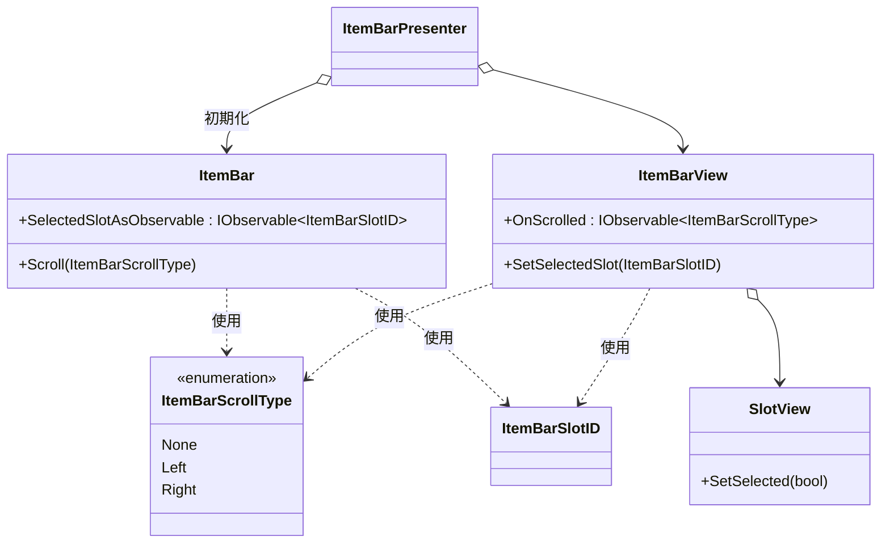

```mermaid
classDiagram
    %% Domain

    class ItemBarSlotID {

    }
    
    class ItemBarScrollType {
        None
        Left
        Right
    }
    <<enumeration>> ItemBarScrollType

    class ItemBar  {
        +SelectedSlotAsObservable : IObservable~ItemBarSlotID~
        +Scroll(ItemBarScrollType)
    }
    %% Domain

    %% View
    class ItemBarView {
        +OnScrolled : IObservable~ItemBarScrollType~
        +SetSelectedSlot(ItemBarSlotID)
    }

    class SlotView {
        +SetSelected(bool)
    }
    %% View

    class ItemBarPresenter {

    }
    
    ItemBar ..> ItemBarScrollType : 使用
    ItemBar ..> ItemBarSlotID : 使用

    ItemBarPresenter o--> ItemBar : 初期化
    ItemBarPresenter o--> ItemBarView

    ItemBarView o--> SlotView
    ItemBarView ..> ItemBarScrollType : 使用
    ItemBarView ..> ItemBarSlotID : 使用
    
```
    